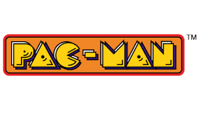

# Recréation de Pac-Man en C++

Ce projet vise à recréer le légendaire jeu Pac-Man en utilisant le langage de programmation C++ moderne. Il s'agit d'une version réinventée de ce classique des jeux d'arcade, développée pour le plaisir et l'apprentissage.

## Fonctionnalités

- La version de base du jeu PACMAN.
- Le score est affiché en haut de l’écran et mis à jour au fur et à mesure que le
joueur mange des pac-gums.
- Les vies du joueur sont affichées et mises à jour à chaque fois que le joueur perd
une vie.
- Les modes des fantômes sont alternés, passant de mode "chase" à mode "scatter"
et vice versa.
- Les pac-gums sont placés sur la carte et disparaissent lorsque le joueur les mange.
- Les tunnels sont implémentés pour que le joueur puisse traverser l’écran de
gauche à droite et vice versa.
- Les fantômes ne peuvent pas faire demi-tour.
- Des musiques basiques sont jouées à chaque fois que le joueur mange une pacgum, perd une vie, etc.

## Comment Jouer

1. Clonez ce repo sur votre machine locale.
2. Compilez le code source C++ à l'aide de votre compilateur préféré.
3. Exécutez le jeu.
4. Utilisez les touches fléchées pour déplacer Pac-Man dans le labyrinthe.
5. Évitez les fantômes tout en mangeant les pac-gommes.
6. Gagnez des points en mangeant des fruits et en terminant les niveaux.

## Configuration du Projet

Le projet est structuré comme suit :

- `src/` : Contient le code source C++ du jeu.
- `assets/` : Inclut les ressources du jeu, telles que les images et les sons.
- `CMakeLists.txt` : Le fichier de configuration CMake pour générer le projet.

## Dépendances

Ce projet utilise SDL2 pour la gestion de la fenêtre et du rendu graphique. Assurez-vous d'installer SDL2 avant de compiler le jeu.

## Bugs

- Les fantômes peuvent prendre le tunnel et tourner dans des zones interdites.
- Les fantômes dans l’antre peuvent passer en mode frightened.
- Quelques bugs sur les modes des fantômes ont été signalés.
- Clyde devient frightened lorsque le joueur l’approche.
- Pacman peut parfois s’arrêter à des intersections, ce qui peut provoquer des
problèmes de gameplay

## Documentation

Vous pouvez retrouver la documentation doxygene [ici](https://m7415.github.io/pacman/).
